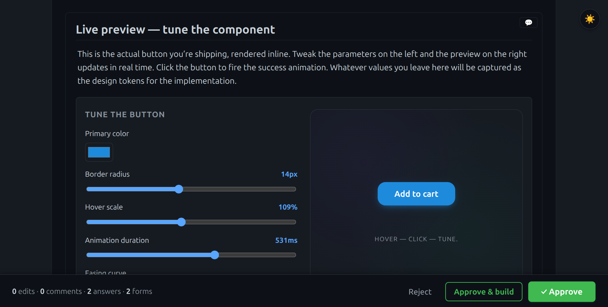
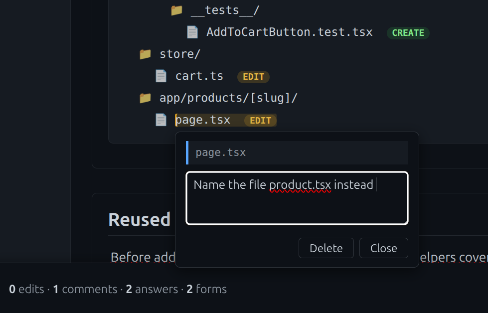
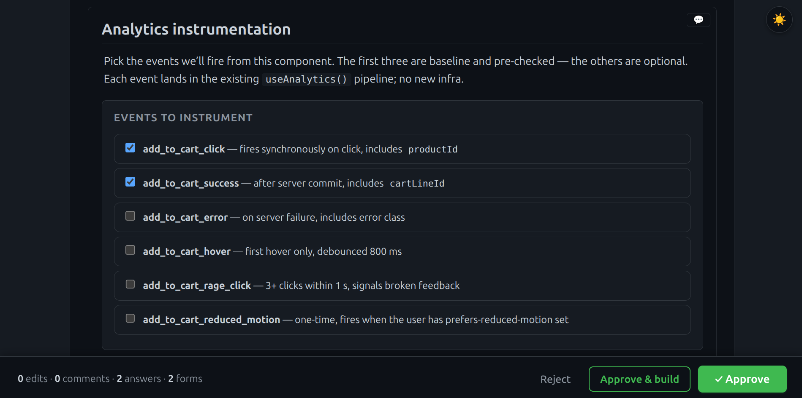
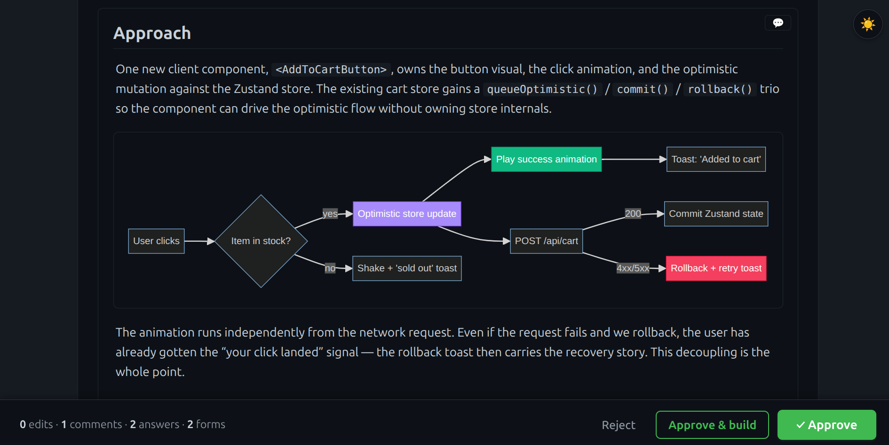

# rich-plan

A Claude Code plugin that turns implementation plans into a self-contained HTML page you review in the browser at your own pace.

When you ask Claude to plan a non-trivial change, the skill:

1. Explores the codebase (delegating to `Explore` subagents in parallel).
2. Optionally fans out 2–3 `rich-plan-designer` subagents, each defending a different design bias, then synthesizes their takes.
3. Writes a single `plan.html` and serves it locally so you can read, edit, comment, and answer questions.
4. Returns your edits and decisions to the agent as a structured submission

Useful for bigger refactors, design choices, anything where async deliberation beats real-time chat.

## Screenshots

**Live, tunable previews.** Sliders, color pickers and dropdowns wire up to a working preview of the component being planned — your final values are captured as design tokens for the implementation.



**Anchored comments.** Hover any file in a tree, any code line, any section — leave a comment in place. Comments come back to the agent with their target locator, so it knows exactly what you were pointing at.



**Structured forms.** Multiple-choice questions and free-form custom forms (rankings, multi-selects, design widgets) are first-class — answers come back as typed data, not free text the agent has to parse.



**Visual richness.** Mermaid diagrams, file trees with CREATE / EDIT / DELETE badges, rendered diffs, syntax-highlighted code, semantic pills.



## Compared to built-in `/plan`

`/plan` keeps everything in the chat: you read, you reply, you scroll. rich-plan moves the review out of the conversation and into a page you can sit with.

| Aspect | Built-in `/plan` | rich-plan |
|---|---|---|
| Chat availability | Blocked — the plan takes over the chat until you reply | Free — the plan lives in a browser tab, so you can keep asking Claude follow-up questions about its details while reading |
| Display | Plain text with ASCII layout | Rich HTML/CSS/JS — readable, interactive, easy on the eyes |
| Editing the plan | Reopen the markdown in your IDE — context switch and extra friction | Edit prose directly in the page; no leaving the review |
| Feedback | Sequential chat replies | Comments anchored to a specific section or line |
| Persistence | Lives in the chat transcript; gone once the session ends | `plan.html` is saved into the project at `.rich-plans/<slug>/` — retrievable later, optionally committed alongside the code |

Under the hood, rich-plan runs the same depth of codebase exploration as `/plan` — and goes further: specialized `rich-plan-designer` subagents draft several competing plans in parallel, then Claude synthesizes them into a single best proposal before handing it to you through the rich plan.

## Installation

Add the marketplace and install:

```
/plugin marketplace add dario-spagnolo/rich-plan
/plugin install rich-plan@rich-plan
```

Then verify with `/plugin` — `rich-plan` should appear as enabled.

## Usage

Invoke the skill explicitly:

```
/rich-plan add a setting to disable the legacy auth flow
```

Or just describe the work and let Claude trigger it:

> Plan the migration from the old auth middleware to the new one — I want to decide before coding.

The skill writes `plan.html` into `.rich-plans/<slug>/` and opens it in your browser. Edit prose inline, leave anchored comments, answer the embedded questions, then click **Submit** — Claude reads your submission and proceeds.

## What ships

- `skills/rich-plan/` — the skill itself (SKILL.md, server, static assets, references).
- `agents/rich-plan-designer.md` — the design-bias subagent invoked from Phase 3 of the methodology.

## Development

This repo doubles as a marketplace catalog (`.claude-plugin/marketplace.json` at root) and the plugin source (`./plugin/`). To work on the plugin locally without going through `/plugin install`, symlink it into your Claude Code config:

```bash
ln -s "$PWD/plugin/skills/rich-plan" ~/.claude/skills/rich-plan
ln -s "$PWD/plugin/agents/rich-plan-designer.md" ~/.claude/agents/rich-plan-designer.md
```

Edits to source files take effect immediately — no reinstall needed.

## License

MIT — see [LICENSE](./LICENSE).
